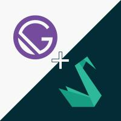

  <h1>Gatsbylius</h1>

  

**The fastest Open Source storefront for Sylius.**

Gatsbylius leverages Gatsby for building eCommerce PWA storefronts using React backed by a headless Sylius store.
Gatsby + Sylius = :rocket:,
[Try the demo.](https://demo.gatsbylius.com/)

  

  

  

Started with :heart: :beers: :fire: in [Béthune #opengento](https://twitter.com/opengento/status/1196360198769778688)

## Overview

**⚠️ Alpha software:** Gatsbylius is in active development, things will change but contributions are welcome.

This monorep contains:

- `gatsby-source-sylius`: This package create the graphql schema from a Sylius API.

## Starter

Check [Gatsbylius/gatsbylius-starter](https://github.com/Gatsbylius/gatsbylius-starter) to start a new gatby site with a Sylius backend.

## Get help

If you need help we encourage you to search on the web first. It will help you discover the community around both project (Gatsby & Sylius). You might find additional resources for learning each library in-depth when you will be ready.

Useful resources:

- https://docs.sylius.com/en/latest/index.html
- https://app.swaggerhub.com/apis/Sylius/sylius-shop-api/1.0.0#/Product
- https://www.gatsbyjs.org/docs/

You can also open
[issues](https://github.com/Gatsbylius/Gatsbylius/issues) with the
tag `"question"` and we will do our best to answer it. Of course, you can
[browse answered questions](https://github.com/Gatsbylius/Gatsbylius/issues?q=is%3Aissue+label%3Aquestion+is%3Aopen)
and try to help others by answering their opened questions.

If you need anything else, [send an email to the team behind it!](mailto:contact@gatsbylius.com) We can also take care of your project!

## Setting up a local dev environment

If you wish to contribute to the project, this part will describe how to get a local dev environment up and running.

> We use [Lerna](https://github.com/lerna/lerna) and [Yarn](https://yarnpkg.com/) to manage a monorepo. It allows us to easily manage and publish our packages.

### Installation

#### Node and yarn

- Install node at least with the version (>= 10.16.0) `node --version`
- Install Yarn at least with the version (>= 1.0.2) `yarn --version`

#### Fork and clone

1. Fork the [gatsbylius/gatsbylius](https://github.com/gatsbylius/gatsbylius) repository
2. `git clone git@github.com:<your-username>/Gatsbylius.git`
3. `cd Gatsbylius && yarn && yarn run bootstrap`
4. open your favorite editor and start coding!

## License

MIT
